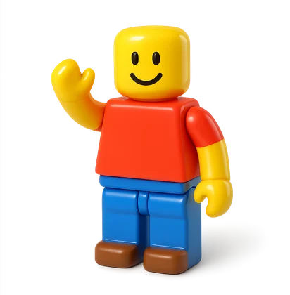
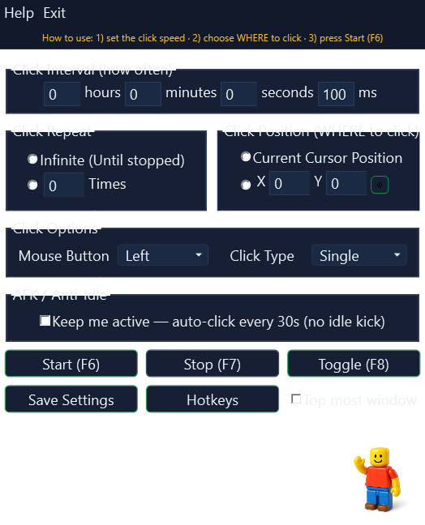

<div align="center">



# Roblox AutoClicker Open

**A free, lightweight and open-source auto clicker built for Roblox and other Windows games.**


<br/>



</div>

## ✨ Features

- 🕒 **Adjustable click speed** — set the interval in hours / minutes / seconds / milliseconds (default `100 ms` = 10 clicks per second).
- 🎯 **Click anywhere** — click at the current cursor position, or pick an exact **X / Y** point on screen with the built-in picker.
- 🖱️ **Any button, any type** — left / right / middle button, single or double click.
- 🔁 **Repeat modes** — click forever (until stopped), or stop automatically after a set number of clicks.
- ⌨️ **Global hotkeys** — **Start (F6)**, **Stop (F7)**, **Toggle (F8)** — they work even while your game is focused.
- 💤 **AFK / Anti-Idle** — an optional gentle click every 30 seconds so you don't get kicked for being idle.
- 📌 **Always-on-top** and **system tray** — keep it in view or tuck it away.
- 📦 **Single portable `.exe`** — no installer, no dependencies. Just download and run.

## 🚀 How to use

1. **Set the click speed** in *Click Interval* (the default `100 ms` works great for most games).
2. **Choose where to click** in *Click Position* — leave it on **Current Cursor Position**, or press the 🎯 picker and click your target on screen.
3. Pick your **Mouse Button** and **Click Type**.
4. Press **Start (F6)** — press **Stop (F7)** at any time.

> Tip: for games, move your mouse over the spot you want and just tap **F6**.

## ⬇️ Download

Grab the latest ready-to-run build from the [**Releases**](../../releases) page:
download the `.zip`, unzip it, and run **`RobloxAutoClickerOpen.exe`**. That's it — nothing to install.

## 🛠️ Build from source

Requires the **.NET SDK**. The project targets **.NET Framework 4.8** and produces a single self-contained `.exe`.

```bash
dotnet build AutoClicker/AutoClicker.csproj -c Release
```

The compiled `RobloxAutoClickerOpen.exe` will be in `AutoClicker/bin/Release/net48/`.

## 📋 Requirements

- Windows 10 or 11
- No installation required — the app is a single portable executable.

## 📜 License

Released under the [MIT License](LICENSE) — free to use, modify and share.
