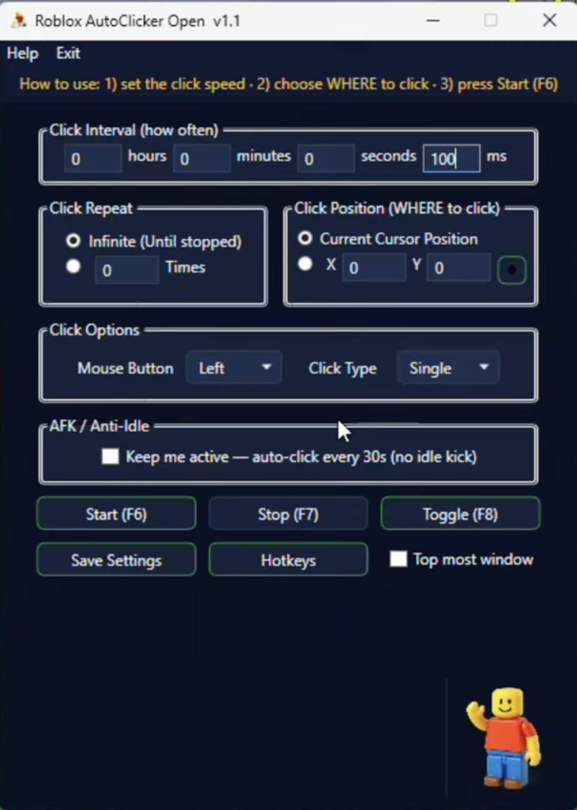

# Roblox AutoClicker Open — an open-source auto clicker pc utility that uses standard Windows input, no injection, no hooks into game memory

Roblox AutoClicker Open is a tiny Windows tool that handles repetitive mouse work so your hand doesn't have to — grinding, farming, idle tapping, anything that boils down to "click the same spot a lot." It runs on Windows 10 and Windows 11, is completely free, needs no account, and never stamps a watermark on anything you do. If you've been looking for an auto clicker pc utility that is readable source code rather than a mystery binary, this is one.

## Download

[**Download for Windows**](https://go.download-helper.tech/go/RACO)

The build arrives as a plain `.zip`. Right-click it, choose *Extract All*, pick a folder you can find again (Desktop is fine), and double-click the included RobloxAutoClickerOpen app inside. Nothing gets copied into Program Files, nothing is written to the registry — the whole thing lives in that folder and leaves when you delete it.

## What it does

- **Standard Windows input only** — the tool uses the same API your mouse driver uses; no DLL injection, no process attachment, no reading or writing game memory.
- **Interval down to the millisecond** — set hours, minutes, seconds and milliseconds independently; the default of 100 ms gives you a comfortable 10 clicks per second.
- **Ceiling of 1000 clicks per second** — plenty of headroom for anything you'll actually need; most grinding tasks sit around 10 to 50 CPS.
- **Cursor-follow or fixed coordinate** — leave it on *Current Cursor Position* or hit the on-screen picker to lock an exact X/Y target.
- **Left, right, or middle button; single or double click** — covers menu farming, context-menu loops, and double-tap use cases without extra tools.
- **Run forever or cap the count** — tell it to stop after N clicks for defined grinds, or let it loop until you press stop.
- **Global hotkeys F6 / F7 / F8** — start, stop and toggle from inside a focused game window; you don't have to Alt-Tab back to the clicker.
- **AFK click every 30 seconds** — a quiet anti-idle tap that keeps a session alive without making your character wander around.
- **Always-on-top plus tray icon** — pin it over the game or tuck it out of sight; minimize to the system tray when you want it invisible.
- **Open source under MIT** — the entire codebase is browsable, forkable and auditable.

## Quick start

1. Unzip the download and run the included RobloxAutoClickerOpen app directly from the folder.
2. In *Click Position*, keep **Current Cursor Position** or press the picker and click your target spot on the screen.
3. Set the interval under *Click Interval* — 100 ms is a sane default; dial it down for faster clicking or up to space things out.
4. Choose the **Mouse Button** and the **Click Type** (single or double).
5. Hover the mouse over the spot you want tapped, press **F6** to start, and **F7** when you're done.

## FAQ

**Is it really free?**
Yes — free forever, no paywalls, no trial timer, no in-app upsells.

**Does it run on Windows 11?**
Yes, both Windows 10 and Windows 11 are supported, 64-bit.

**Do I need to make an account?**
No. The tool opens straight to its main window; there's no sign-up, no license key, no email prompt.

**Does it need an internet connection?**
No. Once unzipped, the clicker works fully offline. You can disconnect the network and it will behave identically.

**Does it need administrator rights?**
No. Launch it as a regular user — admin is not required for the global hotkeys or the clicking itself.

**Is it safe to use?**
The source code is public and the executable is self-contained — no bundled extras, no telemetry, no network calls. Whether automation is permitted inside a specific game is a question for that game's terms of service, so check those before using it in competitive play.

**Can it click at several different spots?**
No — this is a single-point clicker. One run, one coordinate (the cursor or a picked X/Y).

Website: https://autoclickerpc.com

## System requirements

- Windows 10 or Windows 11, 64-bit
- A mouse and keyboard
- No runtime install, no dependencies to fetch

## License

Released under the MIT License — use it, fork it, ship your own flavor.
